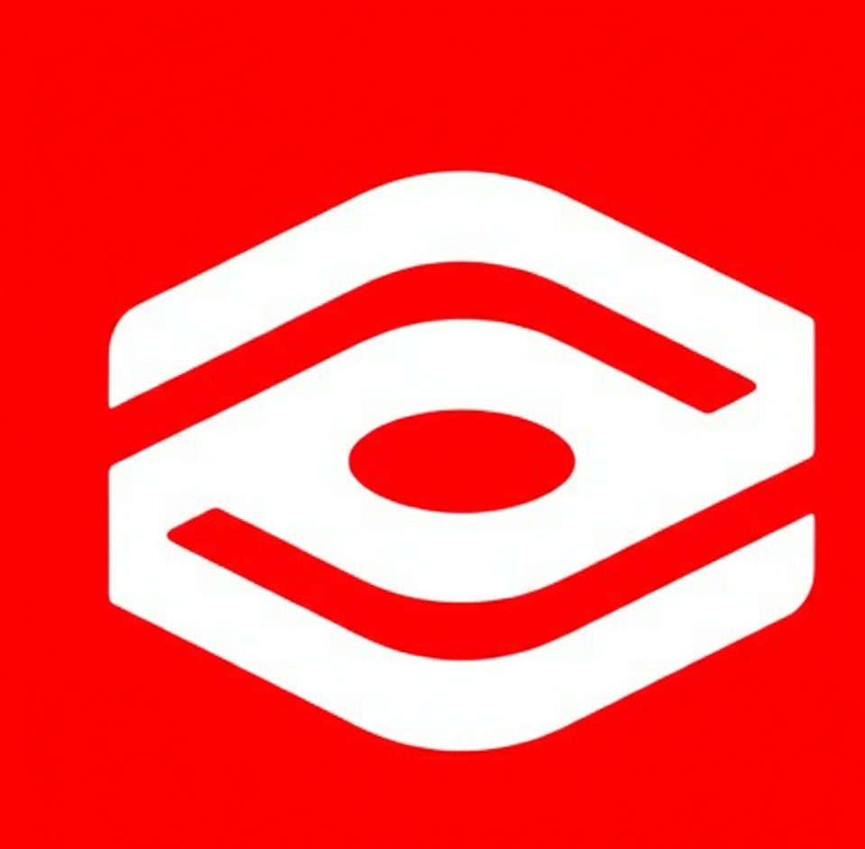

# TedRed Website - Modern Redesign

A stunning, modern website redesign for TedRed featuring a dark futuristic aesthetic with vibrant red accents, smooth animations, and full responsiveness.



## 🚀 Features

- ✨ **Modern Design**: Dark theme with vibrant red accents (#FF4D5A)
- 🎨 **3D Animations**: Stunning hero section with animated 3D visual elements
- 📱 **Fully Responsive**: Mobile-first design that works on all devices
- ⚡ **Smooth Animations**: Framer Motion powered animations throughout
- 🎯 **Interactive Elements**: Hover effects, scroll-triggered animations
- 📝 **Form Validation**: Contact form with React Hook Form + Zod validation
- 🎪 **Testimonials Carousel**: Smooth sliding testimonials with navigation
- 🔍 **Filterable Portfolio**: Project showcase with category filtering
- 🌐 **SEO Optimized**: Proper meta tags and semantic HTML

## 🛠️ Tech Stack

- **React 18** - Modern React with hooks
- **TypeScript** - Type-safe development
- **Vite** - Lightning fast build tool
- **Tailwind CSS** - Utility-first CSS framework
- **Framer Motion** - Production-ready animation library
- **React Hook Form** - Performant form validation
- **Zod** - TypeScript-first schema validation
- **Lucide React** - Beautiful icon library

## 📦 Installation

```bash
# Clone the repository
cd d:\TedRed_website

# Install dependencies
npm install

# Start development server
npm run dev
```

The site will be available at `http://localhost:5173`

## 🏗️ Project Structure

```
src/
├── components/
│   ├── ui/              # Reusable UI components
│   │   ├── Button.tsx
│   │   ├── Card.tsx
│   │   ├── Input.tsx
│   │   ├── Textarea.tsx
│   │   └── SectionTitle.tsx
│   ├── layout/          # Layout components
│   │   ├── Navbar.tsx
│   │   └── Footer.tsx
│   └── sections/        # Page sections
│       ├── Hero.tsx
│       ├── Services.tsx
│       ├── Portfolio.tsx
│       ├── Testimonials.tsx
│       └── Contact.tsx
├── App.tsx              # Main app component
├── main.tsx             # Entry point
└── index.css            # Global styles
```

## 🎨 Design System

### Colors
- **Primary**: #FF4D5A (Vibrant Red)
- **Primary Light**: #FF6B7A
- **Primary Dark**: #E63946
- **Dark**: #0A0A0A
- **Dark Lighter**: #1A1A1A
- **Dark Card**: #1F1F1F

### Typography
- **Display Font**: Syne (headings)
- **Body Font**: Inter (body text)

### Custom Utilities
- `.glass` - Glassmorphism effect
- `.glass-card` - Card with glassmorphism
- `.text-gradient` - Gradient text effect
- `.glow-effect` - Red glow shadow

## 📱 Sections

### 1. Hero
- Animated headline "Innovate. Create. Amplify."
- 3D central visual with rotating rings
- Floating card elements
- CTA button

### 2. Services
Four service cards:
- Technology (500+ projects, 24/7 support)
- Design
- Media
- Marketing

### 3. Portfolio
- Filterable project grid
- 6 sample projects
- Hover effects with image zoom
- Category tags

### 4. Testimonials
- Carousel with 3 testimonials
- Navigation arrows
- Dot indicators
- Client avatars and ratings

### 5. Contact
- Contact information
- Validated contact form
- Real-time validation
- Success/error states

### 6. Footer
- Newsletter subscription
- Social media links
- Company information
- Quick links

## 🚀 Available Scripts

```bash
# Development
npm run dev          # Start dev server

# Production
npm run build        # Build for production
npm run preview      # Preview production build

# Linting
npm run lint         # Run ESLint
```

## 📝 Environment Variables

No environment variables required for basic functionality. For production deployment, you may want to add:

```env
VITE_API_URL=your_api_url
VITE_CONTACT_EMAIL=your_email
```

## 🌐 Browser Support

- Chrome (latest)
- Firefox (latest)
- Safari (latest)
- Edge (latest)

## 📄 License

Copyright © 2026 TedRed. All rights reserved.

## 🤝 Contributing

This is a client project. For any changes or improvements, please contact the TedRed team.

## 📧 Contact

- Email: hello@tedred.com
- Phone: +1 (555) 123-4567
- Location: San Francisco, CA

---

Built with ❤️ using React, TypeScript, and Tailwind CSS
